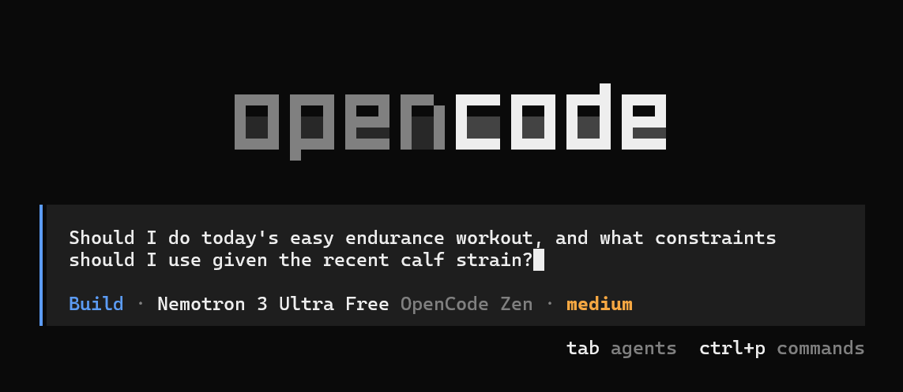
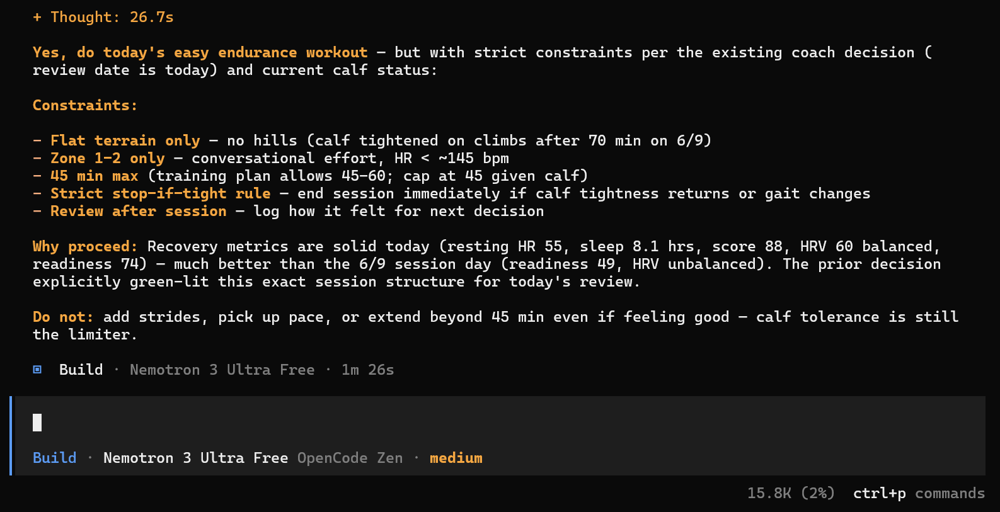

# quick-and-dirty-ai-coach

A local-first AI coaching workflow that can turn health and workout data into training decisions.

The name is intentionally plain: this is not a polished SaaS app. It is a personal setup built around private health data, low operating cost, and coaching that should be accessible from a laptop or phone.

## What It Does

`quick-and-dirty-ai-coach` combines a local SQLite training and health database, structured Markdown context, and a CLI AI agent to act as a personal coach.

The coach can currently:

- sync Garmin health and workout data into a local SQLite database
- import compatible or mapped data from another SQLite database
- analyze recent training load, sleep, HRV, readiness, weather, routes, and strength work
- read workout notes for subjective context such as pain, fatigue, fueling, or session changes
- maintain stable user context, current coaching notes, and a user-facing training plan
- log durable coaching decisions for future sessions
- adjust training recommendations based on recovery, injury risk, event goals, and executed volume

## Why This Exists

Most fitness dashboards are good at displaying metrics but weak at preserving reasoning.

This project focuses on connecting data from wearables to coaching decisions while staying private and maintaining the coach's memory.

The goal is not to replace a professional coach. The goal is to build a small support system for personal training.

Disclaimer: this is a personal decision-support experiment, not medical advice, professional coaching, or a general-purpose fitness product. The sample data in this public repo is fabricated.

## Architecture

The repo is split into:

- `AGENTS.md`: project-level opencode agent workflow and file-role instructions
- `coach/coach_instructions.md`: coaching mentality and operating rules for the coach
- `coach/coach_notes.md`: current status, trends, and watchpoints
- `user/user_profile.md`: user context such as goals, preferences, gear, and injury history
- `user/training_plan.md`: user-facing plan, pacing rules, nutrition targets, and upcoming sessions
- `src/sync.py`: sync CLI dispatcher for source adapters
- `src/sources/`: source adapters
- `src/sources/common.py`: shared adapter CLI helpers for database output and validation
- `src/db/`: schema, database initialization, fabricated sample data, writer, and interpretation notes and example queries for the coach
- `src/session_quickstart.py`: compact database orientation for a new session without prior context
- `.env.example`: required environment variables and local defaults

The sync architecture is intentionally modular. `src/sync.py` handles top-level CLI parsing, source selection, database connection, and writer dispatch. Source-specific fetching lives in `src/sources/`, and database writes are centralized in `src/db/writer.py` against the schema in `src/db/schema.py`.

In a working copy, the AI coach reads:

- stable profile context
- current coach notes
- the user-facing training plan
- compact database orientation from `python src/session_quickstart.py`
- targeted SQL results from the local database
- prior decisions from the `coach_decisions` table

Then it chooses the relevant follow-up queries and gives an answer.

## Database Overview

The local SQLite database is the main data source. By default it lives at:

```bash
src/db/user_data.db
```

Core tables:

- `daily_summary`: sleep, HRV, readiness, resting HR, weight, stress, body battery, training load, and daily activity
- `workouts`: activities, duration, distance, pace, HR, zones, notes, and downsampled datastreams
- `strength_sets`: exercise-level strength set data
- `workout_routes`: GPS route summaries and sampled coordinates
- `workout_weather`: Open-Meteo weather matched to GPS activity location and time
- `coach_decisions`: past coaching decisions, follow-ups, status, and optional workout/date links

The `coach_decisions` table prevents the agent from treating every conversation as fresh context. Before making a new coaching call, the coach checks for recent or active decisions in the same topic, date range, workout, or context.

## Data Sources

Current source adapters:

- `garmin`: syncs daily health summaries, workouts, routes, Open-Meteo weather enrichment, and strength data from Garmin Connect.
- `sqlite_import`: imports compatible or mapped tables from another SQLite database, with planning, dry-run, auto-map, strict mapping, date filters, and per-table imports.

Use `python src/sync.py --help` to list sources and `python src/sync.py <source> --help` for source-specific options. For SQLite imports with renamed source tables or columns, see `src/sources/sqlite_import_mapping.example.md`.

## If You Want to Adapt It

This is published as a portfolio/reference project, not as a ready-to-run product. If you want to use it for yourself, the important parts to change are:

- create a private `.env` from `.env.example` with your own source credentials and database path
- replace the sample coach/user Markdown files with your own profile, current status, and plan
- run `python src/sync.py --help` and `python src/sync.py <source> --help` before syncing data
- run `python src/db/init.py --sample` if you want a tiny fabricated database before connecting real data
- run `python tools/smoke_test.py` if you want to check that the demo database and core CLI paths still work
- use `python src/session_quickstart.py` only after the database has been created and populated
- adapt `AGENTS.md` for your agent CLI; it is written for opencode, and tools such as Claude CLI will not automatically follow it without equivalent instructions in their own format

The intended loop is simple: sync or import data, ask a training question through the agent CLI, and let the coach read the Markdown context plus SQLite summaries before answering.

Example prompt and answer using the fabricated sample database:





Example user prompts:

```text
My calf felt weird this morning. Should I still do today's run?
```

```text
Review my last week and tell me if the weekend long session should change.
```

```text
Did yesterday's high heart rate look like fatigue, heat, or pacing drift?
```

## Design Choices

- SQLite instead of a hosted database for portability and privacy
- Markdown for human-readable context
- SQL for durable, queryable facts and decisions
- source adapters behind a small `src/sync.py` dispatcher for easier additions later on
- Open-Meteo for historical weather enrichment on GPS activities
- downsampled JSON streams for workout and day-level trends to keep data from bloating while preserving precision
- CLI-first operation so it works over SSH and mobile terminals
- no hard dependency on a pay-as-you-go LLM API in the personal workflow

## Status

This is a personal project and reference implementation, not a packaged product. The public version uses non-sensitive sample coach/user context and contains no real health database.

It does not currently include:

- a UI
- packaged installation scripts
- hosted services
- real user data or credentials
- automated tests
